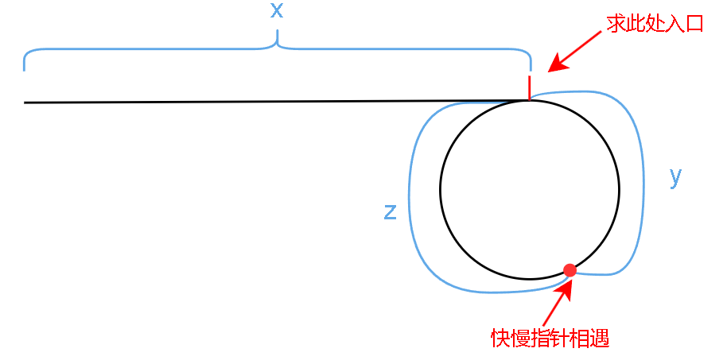

[142. 环形链表 II - 力扣（LeetCode）](https://leetcode.cn/problems/linked-list-cycle-ii/description/)

## Description

给定一个链表，在不修改链表的情况下返回链表开始入环的第一个节点。 如果链表无环，则返回 `null`。

> 评测系统内部使用整数 `pos` 来表示链表尾连接到链表中的位置（**索引从 0 开始**）。如果 `pos` 是 `-1`，则在该链表中没有环。**注意：`pos` 不作为参数进行传递**，仅仅是为了标识链表的实际情况。

**示例 1：**


```
输入：head = [3,2,0,-4], pos = 1
输出：返回索引为 1 的链表节点
解释：链表中有一个环，其尾部连接到第二个节点。
```

**示例 2：**

```
输入：head = [1], pos = -1
输出：返回 null
解释：链表中没有环。
```

**提示：**

- 链表中节点的数目范围在范围 `[0, 104]` 内
- `-105 <= Node.val <= 105`
- `pos` 的值为 `-1` 或者链表中的一个有效索引

**进阶：**你是否可以使用 `O(1)` 空间解决此题？

## Solution

采用快慢指针法，算法的核心是快慢指针相遇的数学原理，主要有两个步骤：

### 步骤一：判断链表是否存在环

- **方法**：使用快慢指针技巧。初始化两个指针，都指向链表的头节点。一个指针（慢指针）每次前进一步，另一个指针（快指针）每次前进两步
- **检测环**：如果链表中存在环，快指针最终将在某个节点处追上慢指针（即两者相遇），这证明链表中存在环。如果快指针遇到 `null`（即 `fast.next == null`），则链表没有环

### 步骤二：确定环的入口—公式推导

> 快慢指针相遇点不一定是环的入口
>
> 利用 **从链表头部到环入口的距离等于从相遇点到环入口的距离** 关系来计算环的入口

- **定义**：

  - 设链表头到环入口的节点数为 x 
  - 设环入口到快慢指针首次相遇点的节点数为 y
  - 设从相遇点再回到环入口的节点数为 z

- **快慢指针运动关系**：

  - 当快慢指针首次相遇时，慢指针走过的节点数为 x + y 
  - 快指针走过的节点数为 x + y + n(y + z) ，其中 n 表示快指针比慢指针多走的圈数，y+z 是环的总长度

- **速度关系推导**：

  - 由于快指针的速度是慢指针的两倍，推理等式：

  ```shell
      2(x + y) = x + y + n(y + z)
  ==>    x + y = n(y + z)
  ==>        x = n(y + z) - y
  ==>        x = (n - 1)(y + z) + z
  ```

- **分类讨论**：

  - 当 n = 1 时，即快指针刚好多走一圈就遇到慢指针，等式简化为 **x = z** 
  - 当 n > 1 时，意味着快指针在环中至少走了一圈以上才遇到慢指针，等式 **x = (n-1)(y + z) + z** 说明从链表头到环入口的距离等于快指针多走的 n-1 圈内节点数加上从相遇点到环入口的距离 z

- **求解环入口**：

  - 根据所得到的数学关系式 `x = (n-1)(y + z) + z` 可以得出：**不论快指针在环中走了多少圈，我们总能通过将一个指针放在链表开始，另一个指针放在相遇点，同时以相同的速度（每次一步）向前移动，它们最终会在环的入口相遇**



### 代码实现

- **初始化指针**：
  - **快指针（`fast`）** 和 **慢指针（`slow`）** 均指向链表的头节点 `head`。快指针每次移动两步，慢指针每次移动一步。
- **检测环的存在**：
  - 当快指针和慢指针都不为 `null` 时，继续遍历链表。快指针每次前进两步，慢指针每次前进一步。
  - 如果链表中存在环，快指针最终会追上慢指针（即两者相遇），此时进入下一步以确定环的入口。如果快指针遇到链表尾（即 `fast` 或 `fast.next` 为 `null`），则链表无环，算法返回 `null`。
- **寻找环的入口节点**：
  - 在快慢指针首次相遇后，初始化两个新的指针 `index1` 和 `index2`。`index1` 从相遇点开始，`index2` 从链表的头节点开始。
  - 同时移动 `index1` 和 `index2`，每次各前进一步。根据链表环的数学属性，当两指针再次相遇时，所在的节点即为环的入口。

```c++
ListNode *detectCycle(ListNode *head) {
    ListNode *fast = head;  // 定义快指针，初始指向链表头部
    ListNode *slow = head;  // 定义慢指针，初始也指向链表头部

    while (fast != NULL && fast->next != NULL) {
        fast = fast->next->next;  // 快指针移动两步
        slow = slow->next;  // 慢指针移动一步

        if (fast == slow) {  // 当快指针追上慢指针时，说明链表存在环
            ListNode *index1 = fast;  // 从快慢指针相遇点开始一个新的指针
            ListNode *index2 = head;  // 从头节点开始另一个新的指针

            while (index1 != index2) {  // 移动两个指针，直到它们在环的入口节点相遇
                index1 = index1->next;
                index2 = index2->next;
            }

            return index1;  // 返回环的起始节点
        }
    }
    return NULL;  // 如果快指针遍历完链表都没有和慢指针相遇，说明链表无环
}
```

- Java 版本：

```java
ListNode detectCycle(ListNode head) {
    // 定义快慢指针
    ListNode fast = head;
    ListNode slow = head;

    // 快慢指针按照不同的速度遍历链表
    while (fast != null && fast.next != null) {
        fast = fast.next.next;
        slow = slow.next;

        // 当两个指针相遇的时候说明链表有环
        if (fast == slow) {
            // 根据发现的数学关系寻找环的入口
            ListNode index1 = fast;
            ListNode index2 = head;

            while (index1 != index2) {
                index1 = index1.next;
                index2 = index2.next;
            }
            // 从快慢指针相遇的位置和head位置同时出发, 但这两个指针相遇时即为环的入口位置
            return index1;
        }
    }
    return null;
}
```

## Conclusion

- **时间复杂度：O(N)**

  - **快慢指针追及过程**：考虑两种情况：

    - **无环情况**：快指针将达到链表末尾，整体遍历次数不超过链表长度 N 的一半加一（因为快指针每步两格），因此，此情况下时间复杂度为 O(N)

    - **有环情况**：快慢指针最终在环内某处相遇。分析相遇点前的移动次数：快指针最多移动 N 次（链表非环部分长度加环长度），相遇通常发生在少于 N 次内。因此，时间复杂度同样为 O(N)

  - **寻找环的入口**：

    - 一旦快慢指针在环中相遇，再使用两个新指针（一个从链表头部开始，一个从相遇点开始），同步移动每次一步，直到它们相遇。这个过程最多需要 N 步，因为环入口最远可能位于链表末尾

  - 综合上述两个过程，整体时间复杂度仍为 O(N)

- **空间复杂度：O(1)**

  - 总共使用了四个指针：`fast`, `slow`, `index1`, 和 `index2`，这些指针仅用于跟踪链表中的位置，不涉及额外的数据结构

  - 因为指针数量不依赖于输入链表的大小，所以空间复杂度为 O(1)，即常数空间复杂度