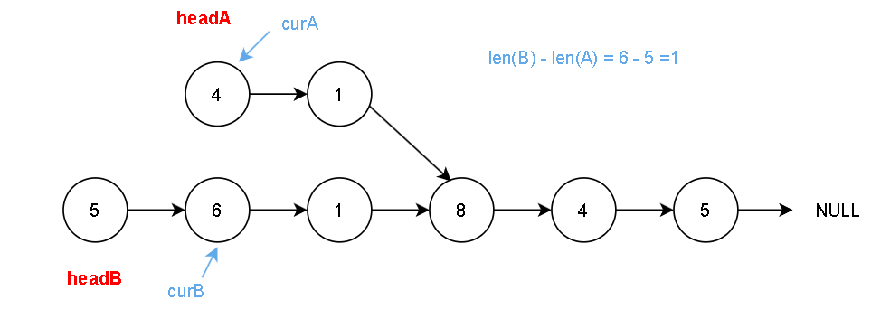
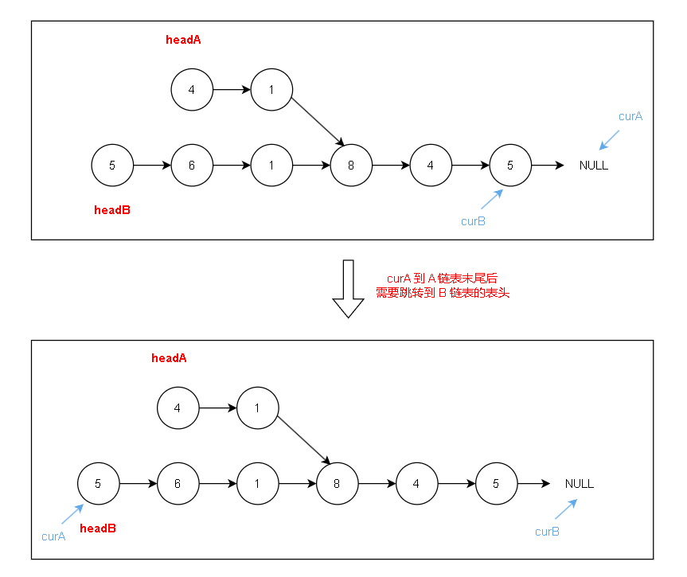
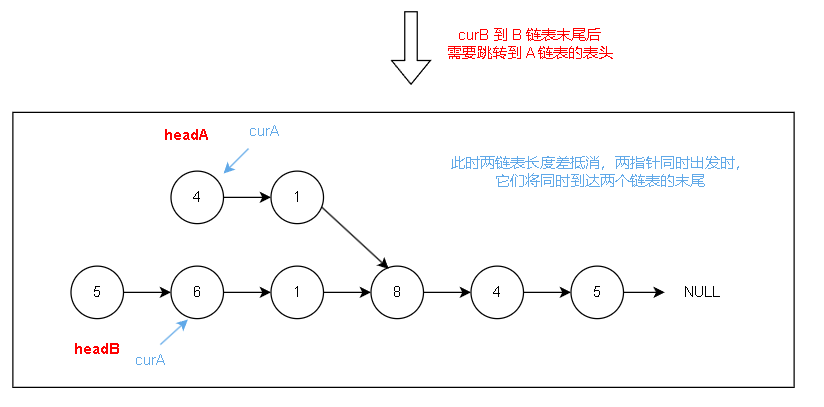

[160. 相交链表 - 力扣（LeetCode）](https://leetcode.cn/problems/intersection-of-two-linked-lists/)

## Description

给定两个单链表的头节点 `headA` 和 `headB` ，要求在不修改链表的前提下找出并返回两个单链表相交的起始节点。如果两个链表不存在相交节点，返回 `null` 。题目数据 **保证** 整个链式结构中不存在环。

> **评测系统** 的输入如下（你设计的程序 **不适用** 此输入）：
>
> - `intersectVal` - 相交的起始节点的值。如果不存在相交节点，这一值为 `0`
> - `listA` - 第一个链表
> - `listB` - 第二个链表
> - `skipA` - 在 `listA` 中（从头节点开始）跳到交叉节点的节点数
> - `skipB` - 在 `listB` 中（从头节点开始）跳到交叉节点的节点数
>
> 评测系统将根据这些输入创建链式数据结构，并将两个头节点 `headA` 和 `headB` 传递给你的程序。如果程序能够正确返回相交节点，那么你的解决方案将被 **视作正确答案** 。

**示例 1：**

[](https://assets.leetcode.com/uploads/2018/12/13/160_example_1.png)

```
输入：intersectVal = 8, listA = [4,1,8,4,5], listB = [5,6,1,8,4,5], skipA = 2, skipB = 3
输出：Intersected at '8'
解释：相交节点的值为 8 （注意，如果两个链表相交则不能为 0，不存在值为 0 的节点）。
从各自的表头开始算起，链表 A 为 [4,1,8,4,5]，链表 B 为 [5,6,1,8,4,5]。
在 A 中，相交节点前有 2 个节点；在 B 中，相交节点前有 3 个节点。
请注意相交节点的值不为 1，因为在链表 A 和链表 B 之中值为 1 的节点 (A 中第二个节点和 B 中第三个节点) 是不同的节点。换句话说，它们在内存中指向两个不同的位置，而链表 A 和链表 B 中值为 8 的节点 (A 中第三个节点，B 中第四个节点) 在内存中指向相同的位置。
```

**示例 2：**

[](https://assets.leetcode.com/uploads/2018/12/13/160_example_3.png)

```
输入：intersectVal = 0, listA = [2,6,4], listB = [1,5], skipA = 3, skipB = 2
输出：null
解释：从各自的表头开始算起，链表 A 为 [2,6,4]，链表 B 为 [1,5]。
由于这两个链表不相交，所以 intersectVal 必须为 0，而 skipA 和 skipB 可以是任意值。
这两个链表不相交，因此返回 null 。
```

**提示：**

- `listA` 中节点数目为 `m`
- `listB` 中节点数目为 `n`
- `1 <= m, n <= 3 * 104`
- `1 <= Node.val <= 105`
- `0 <= skipA <= m`
- `0 <= skipB <= n`
- 如果 `listA` 和 `listB` 没有交点，`intersectVal` 为 `0`
- 如果 `listA` 和 `listB` 有交点，`intersectVal == listA[skipA] == listB[skipB]`

**进阶：**能否设计一个时间复杂度 `O(m + n)` 、仅用 `O(1)` 内存的解决方案？

## Solution

**思考前提**：

- 如果两个链表相交，那么从交点开始到链表的末尾，它们的节点是完全相同的，也就是说，它们**共享同一段尾部**
- 通过**调整较长链表的起点，使得两个链表从调整后的起点到末尾的长度相等**，这样，如果存在交点，它们一定会在某一节点相遇

**关键点：如何同步两个链表的遍历过程？**两种思路：

- **双指针对齐遍历**：通过直接计算两链表的长度差来同步遍历过程。

- **双指针交替遍历**：通过交换指针起点以补足长度差来实现同步遍历。

> 一种方法显式地计算长度并调整起点，而第二种方法则通过交替指针的遍历路径隐式地同步两个链表的指针(代码更简洁)

### 法一：双指针对齐遍历

- **计算两个链表的长度**:
  - 初始化两个指针 `curA` 和 `curB` 分别指向链表A和链表B的头节点。
  - 遍历链表A和链表B，计算它们的长度 `lenA` 和 `lenB`。

- **重置指针到链表头部:**
  - 完成长度计算后，将 `curA` 和 `curB` 重新指向各自链表的头节点 `headA` 和 `headB`，重新从链表的起始位置开始对齐操作。

- **对齐长链表的指针:**
  - 计算两个链表长度的差值，确定需要跳过的节点数目，以便同步两链表的遍历起点。
     - 判断哪个链表更长，然后将较长链表的指针向前移动 `gap` 步。目的是让两个链表的遍历起点在距离尾节点相同的位置，使得接下来的遍历能同步进行：
       - 如果 `lenA > lenB`，即链表A较长，则 `curA` 向前移动 `gap` 步。
       - 如果 `lenB > lenA`，即链表B较长，则 `curB` 向前移动 `gap` 步。

- **同步遍历查找交点**:
  - 从对齐后的位置开始，同时遍历两个链表，即同时移动 `curA` 和 `curB`。
     - 比较每步遍历的节点是否相同。由于两个链表的尾部到交点（如果存在的话）的长度已被对齐，如果它们相交，那么在遍历过程中 `curA` 和 `curB` 应当会在交点处相遇，即 `curA == curB`。
     - 继续这一过程直到 `curA` 和 `curB` 相遇或者同时到达各自的链表末尾（均为 `NULL`），这时循环终止。

- **返回结果:**

  - 如果 `curA` 和 `curB` 在某个节点相遇，那么该节点即为两个链表的交点，返回该节点。

  - 如果两个链表不相交，那么最终 `curA` 和 `curB` 将同时为 `NULL`，函数返回 `NULL`。



```c++
ListNode *getIntersectionNode(ListNode *headA, ListNode *headB) {
    ListNode *curA = headA;
    ListNode *curB = headB;

    // 分别计算两个链表的长度
    int lenA = 0, lenB = 0;
    while (curA != NULL) {
        curA = curA->next;
        lenA++;
    }

    while (curB != NULL) {
        curB = curB->next;
        lenB++;
    }

    // 重置指针到各自链表的头部
    curA = headA;
    curB = headB;

    // 根据长度差调整长链表的指针
    int gap = abs(lenA - lenB);
    if (lenA > lenB) {
        while (gap--) curA = curA->next;
    } else {
        while (gap--) curB = curB->next;
    }

    // 同步遍历两个链表，直到找到交点或者同时到达末尾(都为NULL)
    while (curA != curB) {
        curA = curA->next;
        curB = curB->next;
    }

    return curA;  // 可能返回NULL，表示无交点，或返回交点
}
```

- Java 版本：

```java
public ListNode getIntersectionNode(ListNode headA, ListNode headB) {
    ListNode curA = headA;
    ListNode curB = headB;

    int lenA = 0, lenB = 0;
    while (curA != null) {
        curA = curA.next;
        lenA++;
    }

    while (curB != null) {
        curB = curB.next;
        lenB++;
    }

    curA = headA;
    curB = headB;

    int gap = Math.abs(lenA - lenB);
    if (lenA > lenB) {
        while (gap != 0) {
            curA = curA.next;
            gap--;
        }
    } else {
        while (gap != 0) {
            curB = curB.next;
            gap--;
        }
    }

    while (curA != curB) {
        curA = curA.next;
        curB = curB.next;
    }

    return curA;
}
```

### 法二：双指针交替遍历

- **指针初始化**:
  - 初始化两个指针 `curA` 和 `curB`用来遍历两个链表，分别指向链表A (`headA`) 和链表B (`headB`) 的头节点。
- **指针遍历与交换**:
  - 进行一个 `while` 循环，条件为 `curA != curB`，即两个指针指向的节点不相同。目的是让两个指针在相交节点处相遇，或者在确认无交点后同时达到各自链表的末尾（均为 `NULL`）。
- **指针移动与交换逻辑**:
  - 在每次循环中，分别更新 `curA` 和 `curB`：
    - 如果 `curA` 为 `NULL`（即已遍历完链表A），则将 `curA` 设置为 `headB`，即跳转到链表B的头节点开始遍历。
    - 同理，如果 `curB` 为 `NULL`（即已遍历完链表B），则将 `curB` 设置为 `headA`，即跳转到链表A的头节点开始遍历。
     - 使 `curA` 和 `curB` 不仅遍历自己的链表，还会遍历对方的链表，总遍历长度为 `lenA + lenB`。
- **寻找交点**:
  - 由于每个指针都将遍历 `lenA + lenB` 的长度，无论链表长度如何，它们都将被同步。
     - 如果两链表相交，`curA` 和 `curB` 将在第一次到达交点时相遇。
     - 如果两链表不相交，`curA` 和 `curB` 将在遍历完两链表后同时到达 `NULL`，此时 `while` 循环结束。
- **返回结果:** 返回 `curA`（或 `curB`，此时 `curA == curB`）：
  - 如果存在交点，返回该交点节点。
  - 如果不存在交点，返回 `NULL`。





```c++
ListNode *getIntersectionNode(ListNode *headA, ListNode *headB) {
    ListNode *curA = headA;
    ListNode *curB = headB;

    while (curA != curB) {
        curA = curA == NULL ? headB : curA->next;
        curB = curB == NULL ? headA : curB->next;
    }

    return curA;
}
```

- Java 版本：

```java
public ListNode getIntersectionNode(ListNode headA, ListNode headB) {
    ListNode curA = headA;
    ListNode curB = headB;

    while (curA != curB) {
        curA = curA == null ? headB : curA.next;
        curB = curB == null ? headA : curB.next;
    }

    return curA;
}
```

## Conclusion

**时间复杂度：O(m+n)**

- 双指针**对齐遍历法**：对两个链表进行遍历以计算它们的长度，需要 O(m+n) 时间，即使加上对齐步骤，总的时间复杂度还是 O*(*m+n)，因为所有操作都涉及线性遍历

- 双指针**交替遍历法**：每个指针最多遍历两个链表一次（先遍历自己的链表，然后遍历对方的链表），因此每个指针走过的步数总共是 m+n，包括了从链表A的头到B的尾或者从链表B的头到A的尾，因此时间复杂度同样是 O(m+n)

**空间复杂度：O(1)**

- 仅使用了几个额外的变量来存储长度和进行指针移动，因此空间复杂度为 O(1)