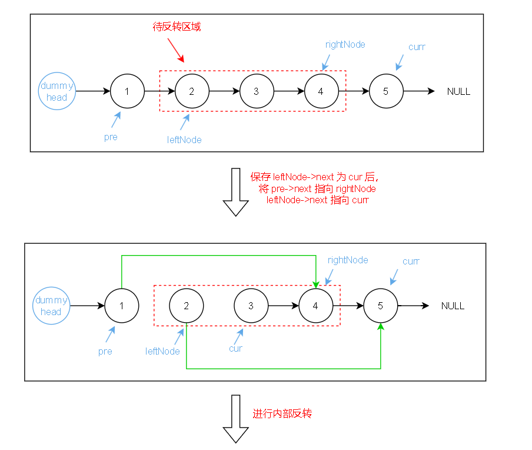
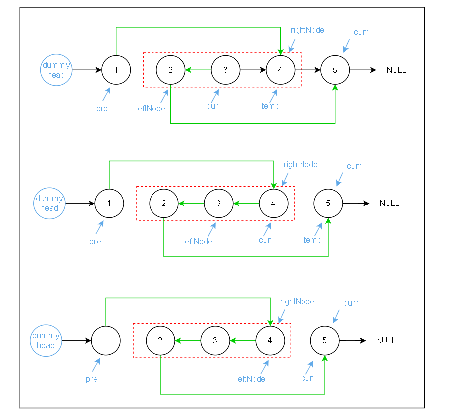
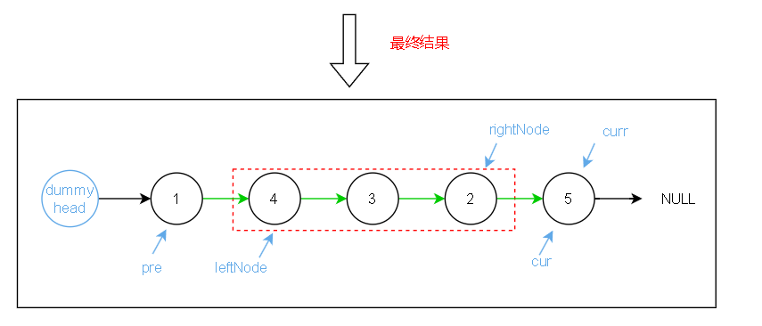

[92. 反转链表 II - 力扣（LeetCode）](https://leetcode.cn/problems/reverse-linked-list-ii/description/)

## Description

给定单链表的头指针 `head` 和两个整数 `left` 和 `right` ，其中 `left <= right` 。要求反转从位置 `left` 到位置 `right` 的链表节点，返回 **反转后的链表** 。

**示例 1：**

```
输入：head = [1,2,3,4,5], left = 2, right = 4
输出：[1,4,3,2,5]
```

**示例 2：**

```
输入：head = [5], left = 1, right = 1
输出：[5]
```

**提示：**

- 链表中节点数目为 `n`
- `1 <= n <= 500`
- `-500 <= Node.val <= 500`
- `1 <= left <= right <= n`

**进阶：** 你可以使用一趟扫描完成反转吗？

## Solution

- **初始化虚拟头节点和指针**：

  - 创建一个虚拟头节点 `dummyHead`，其 `next` 指向链表的头节点 `head`。简化对链表头部操作的处理，尤其是当 `left` 为 1 时。

  - 初始化两个指针 `pre` 和 `rightNode`，都开始于哑节点 `dummyHead`。

- **定位反转区间的前后边界**：

  - **定位 `pre`**：将 `pre` 指针移动到 `left-1` 的位置。这是因为 `pre` 将作为反转部分的前一个节点，负责连接反转后的首节点。

  - **定位 `rightNode`**：将 `rightNode` 指针移动到 `right` 的位置，即反转区间的最后一个节点。

- **保存关键节点**：

  - **保存 `leftNode`**：即 `pre` 的下一个节点，也是反转部分的第一个节点。

  - **保存 `cur`**：`leftNode` 的下一个节点，反转的起始操作节点。

  - **保存 `curr`**：`rightNode` 的下一个节点，反转部分后的第一个节点，保证连接反转后的尾部。

- **重新连接反转区间的边界**：

  - 将 `pre.next` 指向 `rightNode`。此操作将反转区间前的部分直接连接到反转区间的尾部，为接下来的内部反转做准备。

  - 将 `leftNode.next` 指向 `curr`。正确连接反转后的尾部。

- **执行反转操作**：

  - 使用 `cur` 进行遍历，从 `leftNode` 的下一个节点开始，直到 `rightNode` 的下一个节点 `curr`（不包括 `curr`）。这个过程中，节点将逐一反向指向，直到完成整个区间的反转。

  - 在每次迭代中，`cur.next` 指向 `leftNode`，然后更新 `leftNode` 为 `cur`，同时 `cur` 移动到下一个待反转的节点。

- **返回新的链表头**：
  - 通过 `dummyHead.next` 返回新的链表头，这是因为在一些情况下原始的头节点可能已经不再是链表的头节点（尤其是当 `left` 为 1 时）。







```c++
ListNode* reverseBetween(ListNode* head, int left, int right) {
    ListNode *dummyHead = new ListNode(0, head);
    ListNode *pre = dummyHead;
    ListNode *rightNode = dummyHead;

    // 定位 pre 到 left-1 的位置
    while (--left) {
        pre = pre->next;
    }

    // 定位 rightNode 到 right 的位置
    while (right--) {
        rightNode = rightNode->next;
    }

    // 保存反转起始节点及其下一个节点, 以及 rightNode 的下一个节点
    ListNode *leftNode = pre->next;  // 反转起始节点
    ListNode *cur = leftNode->next;
    ListNode *curr = rightNode->next;  

    // 先将pre->next链接到rightNode, leftNode->next链接到curr
    pre->next = rightNode;
    leftNode->next = curr;

    // 执行反转
    while(cur != curr) {
        ListNode *temp = cur->next;  // 保存 cur 的下一个节点
        cur->next = leftNode;  // 反转 cur 指向 leftNode
        leftNode = cur;  // 移动 leftNode 到当前 cur
        cur = temp;  // 移动 cur 到下一个待反转节点
    }

    return dummyHead->next;
}
```

## Conclusion

**时间复杂度**：O(n)

- 对链表进行了三次主要的遍历操作，每次遍历的区间不完全相同，总的时间复杂度依然为 O(n)

**空间复杂度**：O(1)

- 使用了几个额外的指针（`dummyHead`, `pre`, `rightNode`, `leftNode`, `cur`, `curr`）来帮助定位和执行链表的反转操作。这些指针数量固定，不随输入数据的大小（即链表的长度 `n`）而改变，空间复杂度为 O(1)


